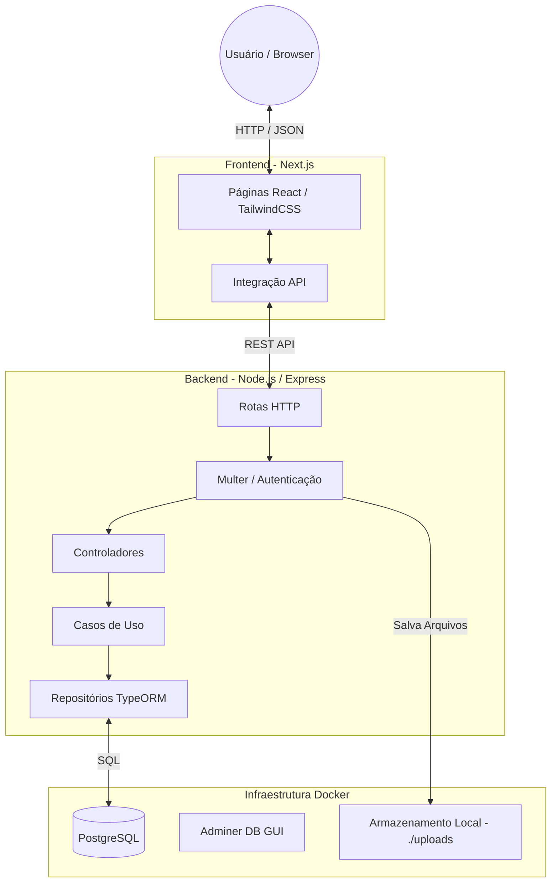

# Simple Storage

Simple Storage é um sistema de gerenciamento de arquivos em nuvem que permite aos usuários criar contas, fazer login, organizar seus arquivos em pastas e visualizar seus documentos de forma rápida e segura.

Este projeto foi desenvolvido com uma arquitetura baseada em microsserviços simples (Frontend + Backend + Banco de Dados) orquestrada com Docker.

## 🚀 Funcionalidades

- **Autenticação:** Registro e Login de usuários de forma segura.
- **Upload de Arquivos:** Envio de arquivos de forma rápida.
- **Limites de Upload:** Validação de tamanho de arquivo no front-end e no back-end (limite de 5MB por arquivo).
- **Organização em Pastas:** Criação de pastas virtuais e organização lógica dos arquivos.
- **Contador de Arquivos:** Visualização no cabeçalho da quantidade total de arquivos do usuário logado.
- **Filtro de Arquivos:** Filtre seus arquivos por tipo (Imagens, Documentos, Outros).
- **Download/Visualização:** Acesso direto aos arquivos salvos.

## 🏗️ Arquitetura do Sistema

O sistema é dividido em três componentes principais:

1. **Frontend:** Uma aplicação React construída com Next.js e TailwindCSS, servindo como a interface de usuário.
2. **Backend:** Uma API REST em Node.js usando Express, TypeORM e Multer (para o gerenciamento de upload no disco local).
3. **Database:** PostgreSQL para persistência de dados (usuários e metadados dos arquivos).

### Diagrama da Arquitetura



## 💻 Tecnologias Utilizadas

### Frontend
- **Framework:** Next.js (React)
- **Estilização:** TailwindCSS
- **Linguagem:** TypeScript

### Backend
- **Ambiente:** Node.js
- **Framework Web:** Express
- **Banco de Dados:** PostgreSQL
- **ORM:** TypeORM
- **Uploads:** Multer
- **Linguagem:** TypeScript

### Infraestrutura
- **Containers:** Docker e Docker Compose
- **Ferramentas Extras:** Adminer (para gerenciamento do banco de dados)

## 🛠️ Como Executar o Projeto

Para rodar este projeto localmente, você precisará ter o [Docker](https://www.docker.com/) e o [Docker Compose](https://docs.docker.com/compose/) instalados na sua máquina.

1. **Clone o repositório:**
   ```bash
   git clone <url-do-repositorio>
   cd Ps_nodejs
   ```

2. **Inicie os serviços via Docker Compose:**
   ```bash
   docker compose up -d
   ```
   > Este comando fará o build das imagens do frontend e backend, além de subir o banco de dados PostgreSQL e o Adminer.

3. **Acesse a aplicação:**
   - **Frontend:** Abra seu navegador em `http://localhost:3000`
   - **Backend API:** Rodando em `http://localhost:3001`
   - **Adminer (Banco de Dados):** Abra `http://localhost:8080` para visualizar os dados diretamente, se necessário. (Sistema: PostgreSQL, Servidor: `db`, Usuário: `postgres`, Senha: `example`, Banco: `storage`)

## 📖 Como Usar o Sistema

1. Ao acessar `http://localhost:3000`, você será redirecionado para a página de **Login**.
2. Clique no link para se **Registrar** e crie uma nova conta com usuário e senha.
3. Faça o **Login** com a conta recém-criada.
4. Na tela inicial (**Simple Storage**):
   - **Upload:** Clique no botão "Adicionar arquivo" (ou na área pontilhada) para fazer upload de um arquivo. Lembre-se do limite de 5MB.
   - **Pastas:** Clique no botão "+ Nova Pasta" para criar um diretório. Clique na pasta criada para entrar nela e fazer upload de arquivos que ficarão salvos lá dentro.
   - **Filtro:** Use o menu dropdown no topo para filtrar a visualização entre "Todos os tipos", "Imagens", "Documentos" e "Outros".
   - **Download/Visualização:** Clique sobre qualquer arquivo para abri-lo em uma nova aba.

## 🛑 Parando a Aplicação

Para parar os containers e o ambiente, execute:
```bash
docker compose down
```
Se desejar remover os volumes de dados (isso **apagará** o banco de dados e os arquivos enviados):
```bash
docker compose down -v
```
